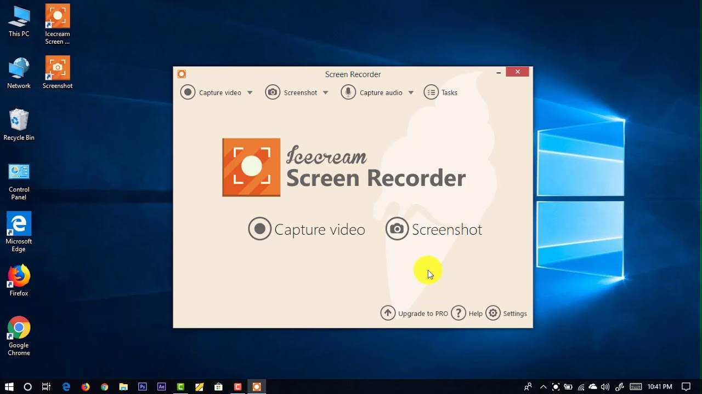

   
   
 

# Icecream Screen Recorder Pro
   
Icecream Screen Recorder is an `easy-to-use` screen recording software that enables you to `record` any area of your screen or save it as a `screenshot`. Record `apps` and `games`, `video tutorials`, `webinars`, `live streams`, `Skype calls` and much more. You can record screen along with `audio` and `webcam`.
   
   
 
 

 

> No Watermark on exported videos, All pro fratures unlocked !
   
 

  
<b><i>Icecream Screen Recorder Pro Crack Full Version Features</i></b>

   
  <ul>
  
  <li>Choose the area to create a video screenshot or right on the screen of your computer with a single click.</li>
  <li>Draw, tracing, show arrows or print text on the future of the screenshot or video directly while shooting.</li>
  <li>Quick access to all the recorded video from the screen or a screenshot.</li>
  <li>Adjust the microphone volume and system sounds.</li>
  <li>Icecream Screen Recorder Pro Crack Save a screenshot to the clipboard to send on Skype or e-mail.</li>
  <li>You decide: whether to remove the mouse, turn off the screensaver there, whether to hide the icons on the desktop, etc.</li>
  <li>One-click to send a screenshot Icecream Apps server to receive and send short links to friends or partners.</li>
  <li>Use hotkeys to control the video recording process with the screen and create screenshots.</li>
  <li>Unlimited recording time</li>
  <li>Changing the output video format – WEBM, MKV, MP4</li>
  <li>Changing the output video codecs – MPEG4, H264, VP8</li>
  <li>Set the timer recording</li>
  <li>Icecream Screen Recorder Pro Crack Setting your own watermark Video</li>
  <li>Turning off the countdown before recording</li>
  <li>Perpetual license for 2 computers</li>
  <li>Commercial use</li>

  </ul>
   

  
<b><i>System Requirements</i></b>

   
  <ul>
    
  <li>OS: Windows 10, 8, 7, Vista.</li>
  <li>Processor: at least 2.66 GHz CPU with Intel, AMD, or equivalent.</li>
  <li>Memory: 2 Gb or more RAM.</li>
  <li>Graphics: video card with at least 1024×768 resolution, but 1280×1024 is recommended.</li>
  <li>Disk space: 150 Mb free space or more + about 5 Gb for screen recordings.</li>
    
  </ul>

 

## Latest Google Drive Download Links
 <li> &nbsp;&nbsp; Icecream Screen Recorder Pro Desktop Installer : <a href='https://drive.google.com/drive/folders/1GIOm-D53KcKhfsz4Lba1uOFPKH3iF7jP?usp=sharing'>Redirect to Drive</a>
